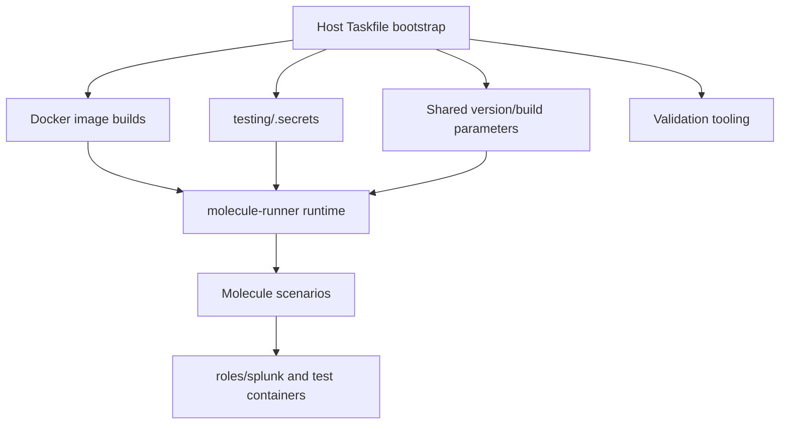
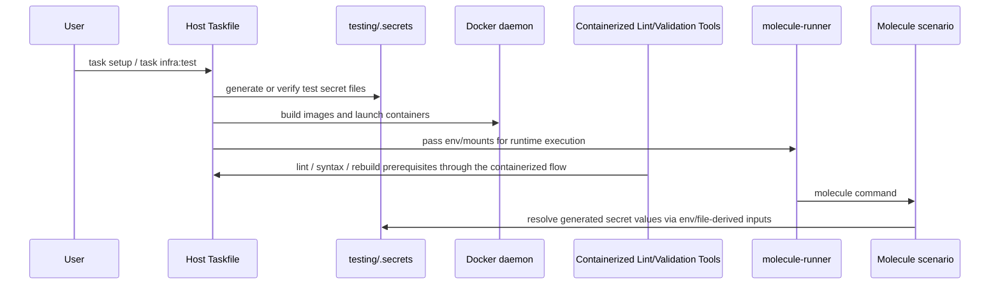

# Design: pr-252-review-fixes

## Tech Stack
- **Language**: YAML, Dockerfile, Markdown
- **Framework**: Ansible, Molecule, Taskfile-based orchestration
- **Testing**: containerized Molecule/Ansible execution, image rebuild checks, and targeted harness reruns
- **Linter**: `ansible-lint` in `molecule-runner`; any additional lint tools must be available through the containerized path or explicitly documented as a gap

## Directory Structure
```
testing/
  Taskfile.yml
  README.md
  docker-images/
    ansible-controller/
    git-server/
  molecule/
    environments/
    infra/
    day0/
    day1/
.kiro/specs/pr-252-review-fixes/
AGENTS.md
```

## Architecture Overview



## Module Design

### Review artifact cleanup
- **Purpose**: Keep the PR diff limited to project files needed to address reviewer comments.
- **Addresses**: Requirement 1
- **Files**:
  ```text
  testing/CLAUDE.md
  testing/PROGRESS.md
  testing/README.md
  ```
- **Dependencies**: branch scoping discipline between feature and PR branches

### Splunk admin secret handling
- **Purpose**: Generate and consume the Splunk admin password through `.secrets` or environment overrides.
- **Addresses**: Requirement 2
- **Files**:
  ```text
  testing/Taskfile.yml
  testing/molecule/environments/*/group_vars/all.yml
  ```
- **Dependencies**: Taskfile secret generation, runtime mounts into the runner container

### Git-server secret handling
- **Purpose**: Remove committed git-server secret literals and inject the secret at runtime from generated or explicit inputs.
- **Addresses**: Requirement 3
- **Files**:
  ```text
  testing/Taskfile.yml
  testing/docker-images/git-server/Dockerfile
  testing/molecule/infra/create.yml
  ```
- **Dependencies**: Docker container env injection, generated secret file availability

### Lifecycle playbook convention cleanup
- **Purpose**: Apply the reviewed interpreter-scope and FQCN conventions with minimal mechanical diffs.
- **Addresses**: Requirement 4, Requirement 5
- **Files**:
  ```text
  testing/molecule/infra/{create,destroy}.yml
  testing/molecule/day0/destroy.yml
  testing/molecule/day0/converge.yml
  testing/molecule/day1/converge.yml
  ```
- **Dependencies**: existing Molecule scenario structure and upstream Ansible style

### Shared artifact metadata parameterization
- **Purpose**: Remove repeated literal version/build values and derive filenames/URLs from shared parameters.
- **Addresses**: Requirement 6
- **Files**:
  ```text
  testing/Taskfile.yml
  testing/molecule/environments/*/group_vars/all.yml
  testing/molecule/day0/converge.yml
  ```
- **Dependencies**: Taskfile env propagation and existing local artifact layout

### Controller image reproducibility
- **Purpose**: Pin the ttyd source checkout to a known version in the ansible-controller image build.
- **Addresses**: Requirement 7
- **Files**:
  ```text
  testing/docker-images/ansible-controller/Dockerfile
  ```
- **Dependencies**: Docker build args and git clone behavior

### Bootstrap architecture clarification
- **Purpose**: Preserve the host-side Taskfile bootstrap while documenting why runtime execution stays containerized.
- **Addresses**: Requirement 8
- **Files**:
  ```text
  testing/README.md
  reviewer response notes
  ```
- **Dependencies**: final validated behavior of the harness bootstrap and runner flow

### Validation tooling readiness
- **Purpose**: Make linting, rebuilds, and representative reruns explicit spec work without assuming host-side Ansible tooling or a new validation task namespace.
- **Addresses**: Requirement 9
- **Files**:
  ```text
  .kiro/specs/pr-252-review-fixes/tasks.md
  developer workflow notes
  ```
- **Dependencies**: host `task` + `docker`, containerized tool availability in `molecule-runner`, and any documented image/tooling adjustments needed for missing checks such as `yamllint`

## Data Flow



## Error Handling Strategy

- Missing generated secret files should fail early during setup or prepare with remediation pointing to `task setup`.
- Shared version/build values should default to the current known-good test versions so existing flows still work.
- Lifecycle cleanup should be mechanical and must not alter playbook behavior beyond the reviewed conventions.
- Validation tooling gaps should be surfaced explicitly as container/tool-image setup or documentation work, not assumed to be host-tool installs.
- Reviewer-facing documentation should preserve the distinction between cross-platform bootstrap and containerized runtime execution.

## Testing Strategy

- **Property tests**: Verify secret consumption, playbook convention compliance, shared artifact coherence, reproducible ttyd pinning, and validation-tool readiness within the containerized harness path.
- **E2E tests**: Run targeted harness commands sufficient to prove the edited workflow bootstraps, rebuilds touched assets where needed, and reaches a representative scenario.
- **Unit tests**: not applicable for this YAML/Dockerfile-focused change set.
- **Primary validation path**: `task` launches `docker run ... molecule-runner ...`
- **Containerized lint command**: use the lint tooling already present in `molecule-runner` rather than assuming host-side Ansible tools
- **Representative rerun commands**: `task setup`, `task infra:test`, and a rebuild path for touched images or artifacts as needed
- **Coverage target**: N/A for this review-driven harness update

## Constraints

- Root `AGENTS.md` and feature-branch spec files belong on the feature branch, not the PR branch.
- The bootstrap layer cannot move entirely into `molecule-runner` because it builds the runner image and prerequisites.
- Avoid adding host shell wrappers because they weaken the cross-platform bootstrap story.
- Changes should remain reviewer-friendly and avoid broad restructuring of the harness.
- Validation claims should match the tools actually available in the containerized harness path, with host requirements limited to launching that path.

## Correctness Properties

### Property 1: PR cleanup removes review-only artifacts without expanding PR scope
- **Statement**: *For any* PR-ready working tree for this change set, when review cleanup is complete, then assistant/progress artifacts are absent from the PR branch while feature-branch-only spec work stays outside the PR diff.
- **Validates**: Requirement 1
- **Example**: `testing/CLAUDE.md` and `testing/PROGRESS.md` are removed from the PR branch, while `.kiro/specs/...` remains feature-branch-only.
- **Test approach**: inspect branch-specific git status/diff and README references.

### Property 2: Splunk admin secret material is generated and consumed through the harness secret workflow
- **Statement**: *For any* harness run requiring the Splunk admin password, when setup/bootstrap completes, then the value is available through generated `.secrets` content or env propagation without committing a hardcoded literal.
- **Validates**: Requirement 2
- **Example**: `task setup:secrets` creates `splunk_admin_password`, and environment group vars consume it without inline credentials.
- **Test approach**: inspect generated file references, lint touched YAML, and run a representative setup command.

### Property 3: Git-server secret material is injected at runtime without committed literals
- **Statement**: *For any* harness run that starts the git-server container, when runtime configuration is applied, then `GITEA__security__SECRET_KEY` comes from env/file-derived input rather than a committed Dockerfile literal.
- **Validates**: Requirement 3
- **Example**: `infra/create.yml` injects `GITEA__security__SECRET_KEY` from a generated or explicit value.
- **Test approach**: inspect Dockerfile/runtime config split and run a representative infra setup path.

### Property 4: Touched lifecycle playbooks use reviewed interpreter and FQCN conventions consistently
- **Statement**: *For any* touched lifecycle playbook, when it needs a Python interpreter override or built-in module reference, then it uses play-level interpreter configuration and `ansible.builtin.*` FQCNs in the edited locations.
- **Validates**: Requirement 4, Requirement 5
- **Example**: `infra/create.yml` defines `ansible_python_interpreter` at play scope and uses `ansible.builtin.pause`.
- **Test approach**: inspect diffs and run ansible-lint on touched playbooks.

### Property 5: Shared version/build metadata keeps touched artifact references coherent
- **Statement**: *For any* touched file that references Splunk artifacts, when the shared version/build values change, then all derived filenames, paths, and URLs stay internally consistent.
- **Validates**: Requirement 6
- **Example**: `Taskfile.yml` and `day0/converge.yml` derive the same tarball names from the same shared values.
- **Test approach**: inspect the shared variables and run the affected task/lint paths.

### Property 6: Controller image builds use an intentionally pinned ttyd source version
- **Statement**: *For any* ansible-controller image build from this PR, when ttyd source is fetched, then the clone targets an explicit version instead of an unpinned default branch.
- **Validates**: Requirement 7
- **Example**: the Dockerfile exposes `TTYD_VERSION` and uses it in the clone command.
- **Test approach**: inspect Dockerfile diffs and rebuild the touched image if tooling is available.

### Property 7: Bootstrap architecture remains host-side while runtime execution remains containerized
- **Statement**: *For any* reviewer-facing explanation or harness doc update, when the bootstrap model is described, then it preserves the distinction between host-side orchestration and containerized runtime execution without introducing shell-wrapper requirements.
- **Validates**: Requirement 8
- **Example**: `testing/README.md` documents Taskfile usage without suggesting that bootstrap lives entirely inside `molecule-runner`.
- **Test approach**: inspect docs and reviewer response notes.

### Property 8: Validation claims are backed by explicit container/tooling setup or documented gaps
- **Statement**: *For any* validation step claimed for this PR, when the required lint/rebuild/rerun tooling is missing from the containerized harness path, then the spec records the needed image/tooling setup or documentation work before treating the fix as fully verified.
- **Validates**: Requirement 9, NF 3
- **Example**: missing `yamllint` in the current runner image is treated as an explicit container/tooling gap rather than a reason to require host-side installs.
- **Test approach**: check available tools in the runner path, run validation commands where possible, and capture any required image/setup tasks.

## Edge Cases

- Existing users may already have `testing/.secrets`; setup must remain idempotent.
- The git-server secret key may need runtime injection rather than immutable Dockerfile build-time substitution.
- Some playbooks may already use partial FQCN forms; updates should avoid unnecessary churn outside touched files.
- Branch-specific expectations differ: feature-branch specs and metadata should not leak into the PR branch.
- Validation tools beyond `task` and `docker` may be absent on the host by design because the harness executes through containers.

## Decisions

### Decision: Keep Taskfile as the cross-platform bootstrap layer
**Context:** A reviewer suggested adding `task` to `molecule-runner` and using a bootstrap script so Docker is the only workstation dependency.
**Options Considered:**
1. Move all bootstrap behavior into `molecule-runner` — Pros: strongest Docker-only story / Cons: circular dependency because bootstrap builds the runner image.
2. Add host shell wrappers — Pros: avoids host `task` install / Cons: reduces cross-platform portability and duplicates orchestration logic.
3. Keep `Taskfile.yml` as the host-side bootstrap/orchestration layer while keeping runtime execution containerized — Pros: cross-platform, minimal churn, matches actual architecture / Cons: host still needs `task` unless a future convenience layer is added.
**Decision:** Keep `Taskfile.yml` as the bootstrap/orchestration layer for this PR.
**Rationale:** It preserves the cross-platform story, matches the existing architecture, and avoids circular or shell-only bootstrapping.

### Decision: Treat validation-tooling gaps as explicit container-path work
**Context:** The implementation can appear complete even when linting or representative reruns were skipped because required tools were unavailable in the containerized validation path.
**Options Considered:**
1. Treat missing tools as a local environment problem and proceed — Pros: less immediate work / Cons: weakens verification claims and misunderstands the harness architecture.
2. Add explicit container/image setup or documentation work for validation prerequisites — Pros: improves auditability and stays aligned with the containerized execution model / Cons: may expand task count slightly.
**Decision:** Capture validation-tooling setup/documentation explicitly in the spec and tasks, but keep the solution aligned with the containerized harness path rather than defaulting to host installs.
**Rationale:** Review-fix work should be auditable through actual or clearly blocked validation in the architecture the harness already uses.

## Security Considerations

- Test-only secret values must remain outside committed source files wherever practical and live under ignored `testing/.secrets` paths.
- Documentation should distinguish lab/test-only credential handling from production guidance.
- Default fallbacks retained for compatibility should be scrutinized to avoid reintroducing reviewer-visible hardcoded secrets.
