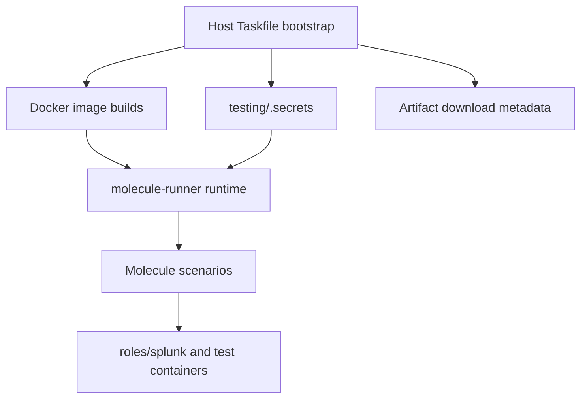
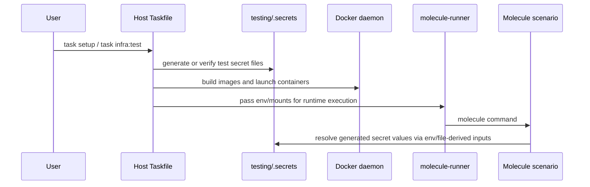

# Design: pr-252-review-fixes

## Tech Stack
- **Language**: YAML, Dockerfile, Markdown
- **Framework**: Ansible, Molecule, Taskfile-based orchestration
- **Testing**: YAML/lint validation and targeted harness command checks
- **Linter**: ansible-lint, yamllint

## Directory Structure
```
testing/
  Taskfile.yml
  README.md
  docker-images/
  molecule/
.kiro/specs/pr-252-review-fixes/
AGENTS.md
```

## Architecture Overview



## Module Design

### Spec and repo metadata
- **Purpose**: Add the required spec artifacts and root `AGENTS.md` snippet for this work.
- **Interface**:
  ```text
  .kiro/specs/pr-252-review-fixes/{requirements,design,tasks,progress}.md
  AGENTS.md
  ```
- **Dependencies**: none

### Harness secret generation
- **Purpose**: Extend `testing/Taskfile.yml` setup so harness-only secret material is generated under `testing/.secrets` and can be injected into downstream tasks.
- **Interface**:
  ```text
  task setup:secrets
  generated files under testing/.secrets/
  env values passed into docker run / container config
  ```
- **Dependencies**: Taskfile commands, `testing/.gitignore`, Molecule runtime mounts

### Harness configuration parameterization
- **Purpose**: Remove repeated hardcoded credential/version values from inventories and scenario files while preserving current behavior.
- **Interface**:
  ```text
  testing/molecule/environments/*/group_vars/all.yml
  testing/molecule/day0/converge.yml
  testing/docker-images/git-server/Dockerfile
  testing/Taskfile.yml
  ```
- **Dependencies**: shared variables from Taskfile/bootstrap env, existing runtime file mounts

### Lifecycle playbook cleanup
- **Purpose**: Apply review-driven Ansible conventions with minimal mechanical diffs.
- **Interface**:
  ```text
  testing/molecule/infra/{create,destroy}.yml
  testing/molecule/day0/destroy.yml
  touched playbooks with built-in module FQCN updates
  ```
- **Dependencies**: existing Molecule scenario structure

### Documentation cleanup
- **Purpose**: Remove stale review artifacts and align README guidance with the new secret/bootstrap behavior.
- **Interface**:
  ```text
  testing/README.md
  ```
- **Dependencies**: final implementation choices for secret generation and bootstrap guidance

## Data Flow



## Error Handling Strategy

- Missing generated secret files should fail early during setup or prepare with explicit remediation pointing to `task setup`.
- Parameterized version/build values should default to the current known-good test versions so existing flows still work.
- Lifecycle playbook cleanup should be mechanical and should not alter task order or behavior beyond the reviewed convention.
- Reviewer-facing documentation should explicitly preserve the distinction between cross-platform bootstrap and containerized runtime execution.

## Testing Strategy

- **Property tests**: Validate that generated secret paths and parameterized values are consumed consistently by touched files.
- **E2E tests**: Run targeted harness commands sufficient to prove the edited workflow still bootstraps and reaches a representative scenario.
- **Unit tests**: not applicable for this YAML/Dockerfile-focused change set.
- **Test command**: `yamllint testing && ansible-lint testing/molecule`
- **Lint command**: `yamllint testing`
- **Coverage target**: N/A for this review-driven harness update

## Constraints

- Root `AGENTS.md` is required on the current branch, but the PR branch cleanup should stay focused on removing `testing/CLAUDE.md` and `testing/PROGRESS.md`.
- The bootstrap layer cannot be moved entirely into `molecule-runner` because it builds the runner image and related prerequisites.
- Avoid adding host shell wrappers because they would undermine the intended cross-platform bootstrap story.
- Changes should remain reviewer-friendly and avoid broad restructuring of the harness.

## Correctness Properties

### Property 1: Secret material is generated and consumed through the existing harness secret workflow
- **Statement**: *For any* harness run requiring test-only credentials, when setup/bootstrap completes, then the required values are available through generated `.secrets` files or env propagation without committing hardcoded literals.
- **Validates**: Requirement 2.1, 2.2, 2.3, 2.4
- **Example**: `task setup:secrets` creates the Splunk admin password and git-server secret inputs, and inventories/runtime configuration consume them without inline literals.
- **Test approach**: inspect generated file references, lint touched YAML, and run a representative setup command.

### Property 2: Lifecycle playbooks follow the reviewed Ansible conventions consistently
- **Statement**: *For any* touched lifecycle playbook, when the playbook needs a built-in module or Python interpreter override, then it uses FQCN built-ins and play-level interpreter configuration rather than task-level `set_fact`.
- **Validates**: Requirement 3.1, 3.2, 3.3
- **Example**: `infra/create.yml` defines `ansible_python_interpreter` at play scope and uses `ansible.builtin.pause` where appropriate.
- **Test approach**: inspect diffs, run ansible-lint on touched playbooks.

### Property 3: Version/build metadata remains coherent across download and scenario references
- **Statement**: *For any* touched file that references Splunk artifacts, when the shared version/build values change, then all derived filenames, paths, and URLs stay internally consistent.
- **Validates**: Requirement 4.1, 4.2, 4.3
- **Example**: `Taskfile.yml` and `day0/converge.yml` derive the same tarball names from the same shared values.
- **Test approach**: inspect the shared variables and run the affected task/lint paths.

### Property 4: Review cleanup narrows the PR without changing bootstrap architecture
- **Statement**: *For any* review-driven cleanup in this PR, when artifacts or docs are removed, then the harness still documents a host-side cross-platform Taskfile bootstrap and a containerized execution path.
- **Validates**: Requirement 1.1, 1.2, 5.1, 5.2, 5.3
- **Example**: `testing/README.md` no longer references `CLAUDE.md`/`PROGRESS.md` and does not introduce shell-wrapper guidance.
- **Test approach**: inspect docs and confirm no new shell bootstrap is introduced.

## Edge Cases

- Existing users may already have `testing/.secrets`; setup must remain idempotent.
- The git-server secret key may need runtime injection rather than immutable Dockerfile build-time substitution.
- Some playbooks may already use partial FQCN forms; updates should avoid unnecessary churn outside touched files.
- Branch-specific expectations differ: root `AGENTS.md` belongs on the current branch, while review cleanup targets the PR branch.

## Decisions

### Decision: Keep Taskfile as the cross-platform bootstrap layer
**Context:** A reviewer suggested adding `task` to `molecule-runner` and using a bootstrap script so Docker is the only workstation dependency.
**Options Considered:**
1. Move all bootstrap behavior into `molecule-runner` — Pros: strongest Docker-only story / Cons: circular dependency because bootstrap builds the runner image.
2. Add host shell wrappers — Pros: avoids host `task` install / Cons: reduces cross-platform portability and duplicates orchestration logic.
3. Keep `Taskfile.yml` as the host-side bootstrap/orchestration layer while keeping runtime execution containerized — Pros: cross-platform, minimal churn, matches actual architecture / Cons: host still needs `task` unless a future convenience layer is added.
**Decision:** Keep `Taskfile.yml` as the bootstrap/orchestration layer for this PR.
**Rationale:** It preserves the cross-platform story, matches the existing architecture, and avoids circular or shell-only bootstrapping.

## Security Considerations

- Test-only secret values must remain outside committed source files wherever practical and live under ignored `testing/.secrets` paths.
- Documentation should continue to distinguish lab/test-only credentials from production guidance.
- Any default fallbacks retained for compatibility should be scrutinized to avoid reintroducing reviewer-visible hardcoded secrets.
